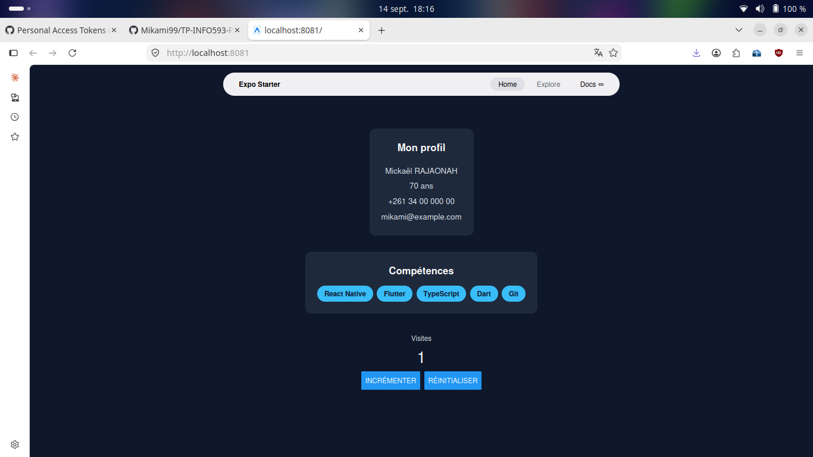
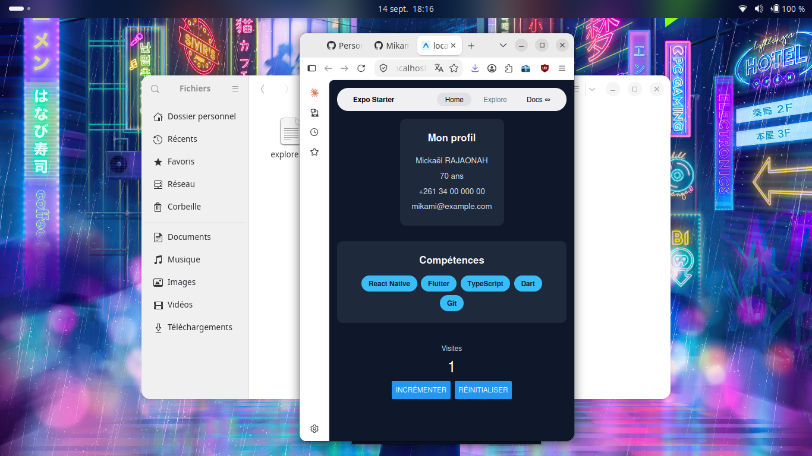
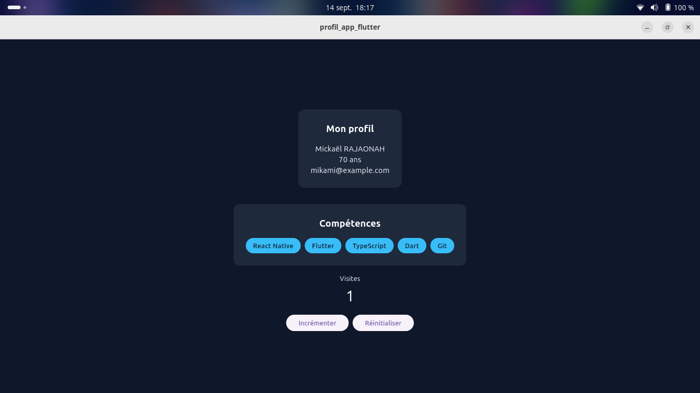
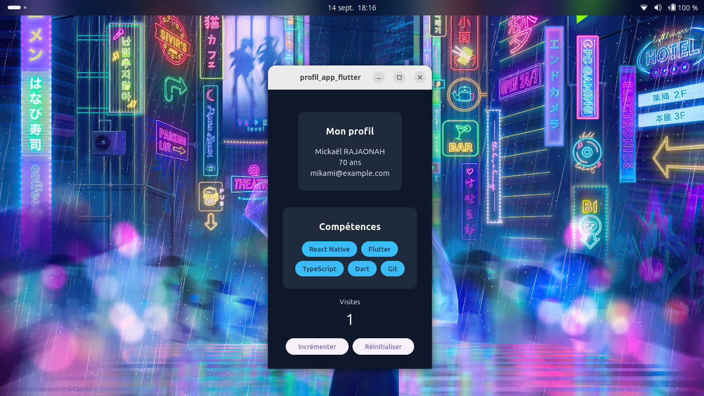

# TP1 - Environnement React Native / Flutter

## Versions
- Node.js : v24.21.0
- npm : 11.19.0
- Flutter : 3.47.4 (stable)
- Dart : 3.13.3

## Émulateur Android
- Medium_Phone_API_36.1 → identifiant : emulator-5554

## Commandes utiles

| Commande | Usage |
|---|---|
| `npx expo start` | Lancer le serveur de dev Expo |
| `flutter run -d linux` | Lancer l'app Flutter en fenêtre desktop (léger, sans émulateur) |
| `flutter run -d emulator-5554` | Lancer l'app Flutter sur l'émulateur Android |
| `flutter doctor -v` | Diagnostic détaillé de l'environnement |
| `flutter doctor --android-licenses` | Accepter les licences Android SDK |
| `flutter emulators` | Lister les émulateurs Android disponibles |
| `flutter devices` | Lister les appareils/émulateurs connectés |
## TP2 - Composants et widgets

- Composant réutilisable ProfileCard créé dans les deux technos :
  - React Native : profil-app-rn/src/components/ProfileCard.tsx
  - Flutter : profil_app_flutter/lib/profile_card.dart
- Champ téléphone facultatif (nullable en Dart, condition ternaire en TS)
- Comparaison props (RN) vs constructeur (Flutter) : en React Native les
  données passent par un objet props déstructuré, typé par TypeScript en
  couche additionnelle ; en Flutter elles passent par le constructeur de
  la classe, avec un typage natif au langage (erreur de compilation si
  incorrect, pas seulement un avertissement).
## TP3 - État local

- Compteur avec état local dans les deux technos :
  - React Native : profil-app-rn/src/components/Counter.tsx
  - Flutter : profil_app_flutter/lib/counter_widget.dart
- Boutons Incrémenter / Réinitialiser (désactivé quand le compteur vaut 0)
- Message "Tu es un pro du clic !" affiché à partir de 10 clics
- useState (RN) vs setState (Flutter) : les deux servent à dire au
  framework "une donnée a changé, redessine l'écran" ; useState est un
  hook appelé dans un composant-fonction, setState est une méthode
  appelée dans un composant-classe (State).
## TP4 - Synthèse

Application de présentation d'un étudiant, dans les deux technos : profil, liste
de compétences, compteur de visites, thème cohérent (couleurs/espacements
centralisés dans theme.ts / theme.dart), composants réutilisables (ProfileCard,
SkillsList, compteur).

- React Native : profil-app-rn/src/components/{ProfileCard,SkillsList,Counter,theme}.tsx
- Flutter : profil_app_flutter/lib/{profile_card,skills_list,counter_widget,theme}.dart

### Prérequis
- Node.js v24.21.0, npm 11.19.0
- Flutter 3.47.4 (stable), Dart 3.13.3
- Un navigateur (Chrome/Firefox) ou un émulateur Android

### Installation
```bash
# React Native
cd profil-app-rn
npm install

# Flutter
cd profil_app_flutter
flutter pub get
```

### Lancement
```bash
# React Native
cd profil-app-rn
npx expo start
# puis touche 'w' (web) ou 'a' (Android)

# Flutter
cd profil_app_flutter
flutter run -d linux    # ou -d chrome, -d emulator-5554
```

### Cible testée
- Linux desktop (Ubuntu 26.04) pour les deux applications
- Web (navigateur) pour React Native
- Émulateur Android (Pixel, API 36, ID emulator-5554) ponctuellement

### Difficultés rencontrées
- Licences Android SDK non acceptées au départ (`flutter doctor --android-licenses`)
- `sdkmanager` manquant : cmdline-tools Android à installer séparément
- `.npmrc` global contenant une ligne invalide (`allow-scripts=...`) bloquant tous les `npm install`
- Chrome (snap) refusant de se lancer depuis Flutter (`flutter run -d chrome`) → utilisation de `-d linux` à la place
- Cache CMake invalidé après renommage du dossier racine → résolu avec `flutter clean`
- Timeout réseau lors du premier `git push` (connexion lente) → résolu avec `git config http.postBuffer` et `http.lowSpeedTime`

### Captures d'écran
| Desktop | Mobile |
|---|---|
|  |  |
|  |  |
